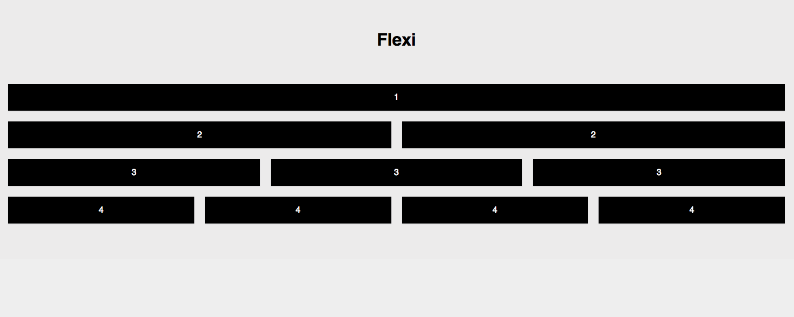

#Flexi Flexbox Grid
Flexi is an extremely simple CSS grid. Drop it in an go. The intention is to be as light weight as possible. Let me know if you see improvements that could make it lighter!



```
<div class="row">
	<div class="col-1">1</div>
</div>

<div class="row">
	<div class="col-2">2</div>
	<div class="col-2">2</div>
</div>

<div class="row">
	<div class="col-3">3</div>
	<div class="col-3">3</div>
	<div class="col-3">3</div>
</div>

<div class="row">
	<div class="col-4">4</div>
	<div class="col-4">4</div>
	<div class="col-4">4</div>
	<div class="col-4">4</div>
</div>

```
